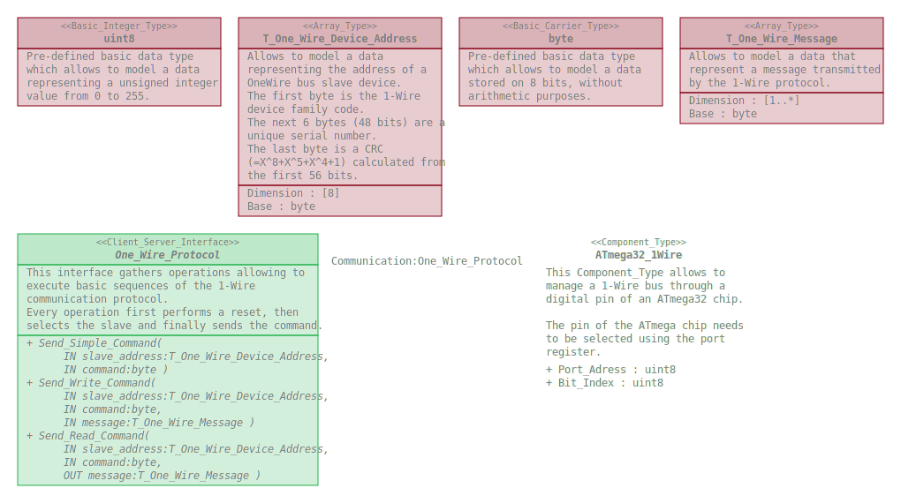

# ATmega_One_Wire

This repository defines a package gathering software elements allowing to manage
a 1-Wire bus through a digital pin of an ATmega chip.

## Overview

## Dependencies

* One_Wire_Interfaces : https://github.com/SanteyneEmbeddedSystems/One_Wire_Interfaces/releases/tag/v1.0.0
* Bit_Field : https://github.com/SanteyneEmbeddedSystems/Bit_Field/releases/tag/v1.0.0
* Timing : https://github.com/SanteyneEmbeddedSystems/Timing/releases/tag/v1.0.0

## Use

### With the Arduino IDE

This repository shall be clone within the _libraries_ folder of the _Arduino
sketchbook folder_.